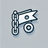

# Link Bookmarker Chrome Extension

A Chrome extension that allows users to easily bookmark links on any webpage with a simple hover interface.

## Table of Contents
- [Icons](#icons)
- [Features](#features)
- [Installation](#installation)
- [Usage](#usage)
- [Technical Details](#technical-details)
- [Files Structure](#files-structure)

## Icons
The extension uses the following icons:
- 🔖: 

## Features

- Hover-to-show bookmark button on all links
- One-click bookmarking functionality
- Persistent storage of bookmarks
- Easy bookmark management through popup interface
- Works on any website
- Clean and intuitive user interface

## Installation

1. Clone or download this repository
2. Open Chrome and navigate to `chrome://extensions/`
3. Enable "Developer mode" in the top right corner
4. Click "Load unpacked" and select the extension directory
5. The Link Bookmarker extension icon should now appear in your Chrome toolbar

## Usage

### Bookmarking Links

1. Hover over any link on a webpage
2. A bookmark icon (🔖) will appear next to the link
3. Click the bookmark icon to save the link
4. The bookmark icon will turn blue to indicate the link is saved

### Managing Bookmarks

1. Click the extension icon in the Chrome toolbar
2. View all your saved bookmarks in the popup window
3. Click on any bookmark to open it in a new tab
4. Use the "Remove" button to delete unwanted bookmarks

## Technical Details

The extension is built using:
- HTML/CSS for the popup interface
- Vanilla JavaScript for functionality
- Chrome Extension Manifest V3
- Local storage for bookmark persistence

## Files Structure

```
- manifest.json      # Extension configuration
- popup.html        # Bookmark management interface
- content.js        # Content script for bookmark functionality
- styles.css        # Styling for bookmark buttons and popup
- icons/            # Extension icons
```

## License

MIT License - feel free to use and modify for your own projects.
